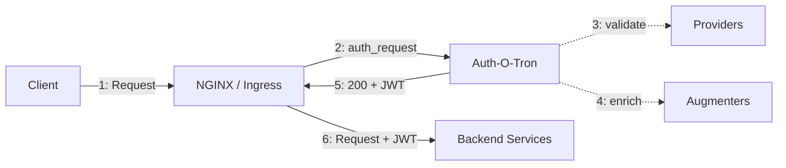

<div align="center">

[](https://crates.io/crates/authotron)
[](https://github.com/ecmwf/auth-o-tron/blob/main/LICENSE.txt)
[](https://github.com/ecmwf/codex/raw/refs/heads/main/ESEE)
[](https://github.com/ecmwf/codex/raw/refs/heads/main/Project%20Maturity)

</div>

> [!IMPORTANT]  
> This software is **Emerging** and subject to ECMWF's guidelines on [Software Maturity](https://github.com/ecmwf/codex/raw/refs/heads/main/Project%20Maturity).

Effortless authentication and authorization for web APIs.

* Easily configure HTTP APIs to use a variety of authentication providers.
* Make requests to Auth-O-Tron from your service, or simply use Auth-O-Tron as an ingress auth proxy.


## Why do I need Auth-O-Tron?

Modern authentication providers are great for securely authenticating and authorizing interactive users in a browser. However, they often lack sensible flows for access to web APIs, especially in a machine-to-machine environment. Auth-O-Tron is a simple service that sits between your API and your authentication providers, allowing you to easily configure your API to use a variety of authentication providers.


## How does it work?

Auth-O-Tron is deployed as a standalone service alongside your ingress (e.g. NGINX `auth_request`). It validates credentials, enriches users with roles and attributes, and returns a signed JWT that your backend services can trust.



Auth-O-Tron can be configured to use a variety of authentication providers simultaneously and cumulatively. See the [documentation](#documentation) for configuration details.

## FAQ

### What authentication methods are supported?

* **Basic auth** (plain provider) — static username/password lists
* **JWT/JWKS** — validate Bearer tokens against a JWKS endpoint
* **OpenID Connect offline tokens** — introspect and exchange offline tokens for access tokens
* **ECMWF API keys** — validate tokens against the ECMWF identity service
* **EFAS API keys** — validate tokens against the EFAS identity service
* **ECMWF Token Generator** — validate and exchange tokens via the ECMWF token generator

Multiple providers can run simultaneously, each targeting a different realm.

### Why opaque tokens instead of JWTs for long-lived access?

JWTs are self-contained and stateless, which is great for short-lived tokens. But for long-lived machine-to-machine tokens that may need to be revoked, you need server-side state anyway. Opaque tokens are simpler and more secure in this case — they don't leak user information if compromised.

Auth-O-Tron issues short-lived JWTs to backend services for authorization decisions. Long-lived opaque tokens are managed separately through the token store.

### Why not just use OAuth2 directly?

OAuth2 works well for interactive browser flows but is complex for machine-to-machine access. The offline_access token flow is closer to what's needed, but every application would have to manage token exchange independently. Auth-O-Tron handles this at the infrastructure level — your applications just trust the JWT.

## Installation

**From crates.io:**

```bash
cargo install authotron
```

**Docker:**

```bash
docker pull eccr.ecmwf.int/auth-o-tron/auth-o-tron:latest
```

## Documentation

Full documentation is available in the `docs/` directory. To build and view it locally:

```bash
cargo install mdbook mdbook-mermaid
mdbook serve docs --open
```

## License

Apache-2.0 — see [LICENSE.txt](LICENSE.txt).

