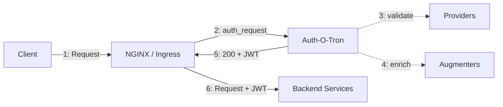

Auth-O-Tron is an authentication gateway designed to work with your ingress layer (e.g., NGINX `auth_request`). It validates credentials from multiple sources, enriches users with roles and attributes, and returns signed JWTs that your backend services can trust.

## Key Features

- **Multiple Auth Providers**: Run JWT, OpenID Connect, API key validation, and basic auth simultaneously. Each provider can target a different realm.
- **NGINX Integration**: Drop-in compatibility with `auth_request`. Auth-O-Tron returns 200/401 responses that NGINX uses to allow or block requests.
- **JWT Proxying**: Authenticated users receive a signed JWT that downstream services can verify without calling back to the gateway.
- **Attribute-Based Access Control**: Define rules based on user roles, groups, or custom claims from your identity providers.
- **Production-Ready**: Written in Rust, ships as a single binary with no runtime dependencies. Starts fast, uses minimal memory, runs well in containers.

## Architecture

Auth-O-Tron handles authentication at the edge. Once validated, NGINX forwards the original request to your backend with the signed JWT attached. Your backends stay simple — they just trust the token.

## Source Code

<https://github.com/ecmwf/auth-o-tron>
