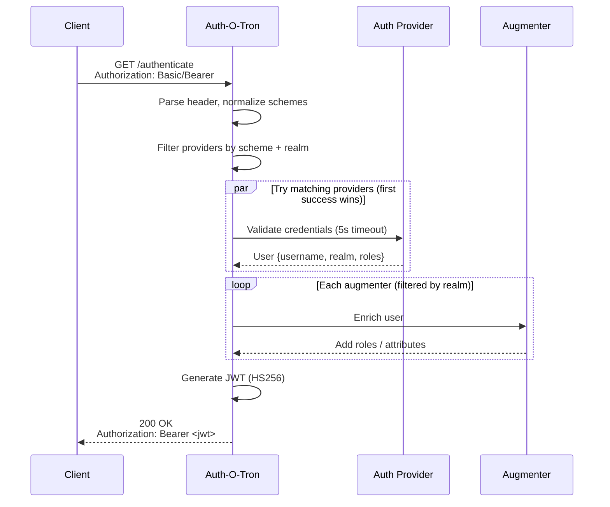

# How It Works

Auth-O-Tron acts as a gateway between clients and your services. It validates credentials from multiple sources and returns a signed JWT that downstream services can trust.

## Authentication Flow

Here is the complete flow from request to JWT:

## Realms

A realm is a named authentication boundary. Every provider and augmenter belongs to exactly one realm. Realms let you run completely separate authentication setups side by side — different user databases, different token validation, different role sources — within a single Auth-O-Tron instance.

Usernames must be unique within a realm. The JWT `sub` claim is formatted as `{realm}-{username}`, so `internal-alice` and `external-alice` are distinct identities.

Clients can target a specific realm by sending the `X-Auth-Realm` header. Without it, all providers are eligible regardless of realm.

## Provider Chain

Auth-O-Tron can run multiple authentication providers side by side. You might have:

- Plain provider (Basic auth) for internal users
- JWT provider (Bearer tokens) for API clients
- OpenID Connect offline tokens for external partners

Each provider targets a specific realm. When a client sends `X-Auth-Realm: internal`, only providers matching that realm will attempt authentication. Without the header, all providers are eligible.

The provider chain uses a "first match wins" strategy. All eligible providers run in parallel with a configurable timeout. The first successful result is used. If all fail, the client receives a 401 response with `WWW-Authenticate` challenges listing the available schemes.

## Augmenters

After authentication succeeds, augmenters enrich the user object with additional roles and attributes. Common use cases:

- **LDAP augmenter**: Query your directory to add group memberships as roles
- **Plain augmenter**: Static role mappings based on username patterns
- **Plain advanced**: Match against usernames or existing roles, then add new roles and attributes

Augmenters also respect realm filtering. If your LDAP augmenter targets `realm: internal`, it only runs for users authenticated against providers in that realm. This lets you maintain separate attribute sources for different user populations.

Non-`plain_advanced` augmenters (LDAP, plain) run in parallel. `plain_advanced` augmenters run sequentially after all parallel augmenters complete, so they can match on roles added by other sources. Augmenters add roles and attributes but never remove existing ones.

## JWT Claims

The resulting JWT contains these standard and custom claims:

- **sub**: Subject, formatted as `{realm}-{username}`
- **iss**: Configured issuer (your organization)
- **exp**: Expiration time (configurable, respects user attribute `exp` if present)
- **iat**: When the token was issued
- **roles**: Array of role strings from augmenters
- **username**: Human-readable username
- **realm**: The realm that authenticated this user
- **scopes**: Permissions or scopes if provided by the auth source
- **attributes**: Key-value map of additional user properties from augmenters

Downstream services validate this JWT using the shared secret and extract user context without needing to query Auth-O-Tron again.

## Consumer contract notes

If you consume JWTs through `authotron-client` (instead of decoding JWTs yourself), two normalization rules apply:

- A synthetic `"default"` role is injected and deduplicated so every decoded user has at least one role.
- `attributes` are normalized to `HashMap<String, String>`:
  - JSON strings are passed through unchanged
  - numbers/booleans/null/arrays/objects are stringified to JSON form

For Polytope/BITS integration, the canonical downstream payload is stored under `job.user.auth` and currently uses `version: 1`.
