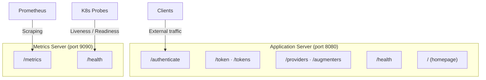

# Server & Metrics

The `server` and `metrics` sections control how Auth-O-Tron exposes its services.

## Server Configuration

The `server` block configures the main application server that handles authentication requests.

| Field | Type | Default | Description |
|-------|------|---------|-------------|
| host | string | "0.0.0.0" | The network interface to bind to |
| port | integer | required | The port number to listen on |

```yaml
server:
  host: "0.0.0.0"
  port: 8080
```

## Metrics Configuration

The `metrics` block configures a separate server for Prometheus-compatible metrics and health checks.

| Field | Type | Default | Description |
|-------|------|---------|-------------|
| enabled | boolean | true | Whether to start the metrics server |
| port | integer | 9090 | The port number for metrics |

```yaml
metrics:
  enabled: true
  port: 9090
```

## Endpoint Mapping



The application server and metrics server expose different endpoints:

**Application Server (configured `server.port`):**
- `/authenticate` - Authentication endpoint
- `/tokens` - Token management
- `/providers` - Provider information
- `/augmenters` - Augmenter information
- `/health` - Health check

**Metrics Server (configured `metrics.port`):**
- `/metrics` - Prometheus metrics
- `/health` - Health check

Note that `/health` is available on both servers when metrics are enabled. When `metrics.enabled: false`, `/health` is only served on the application port.

## Port Collision Detection

Auth-O-Tron validates that the application port and metrics port are different. If you accidentally configure them to the same value, the server will fail to start with an error message explaining the conflict.

```yaml
# This configuration will FAIL - ports are the same
server:
  port: 8080

metrics:
  enabled: true
  port: 8080  # ERROR: Cannot be the same as server.port
```

## Example Configurations

**Minimal configuration (metrics disabled):**

```yaml
version: "2.0.0"

server:
  port: 8080

metrics:
  enabled: false
```

**Full configuration with custom ports:**

```yaml
version: "2.0.0"

server:
  host: "127.0.0.1"
  port: 8080

metrics:
  enabled: true
  port: 9090
```
