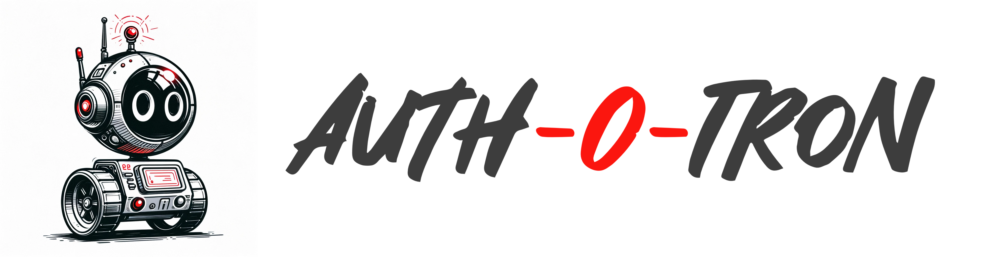

  
  

[test dont merge]

> [!IMPORTANT]  
> This software is **Emerging** and subject to ECMWF's guidelines on [Software Maturity](https://github.com/ecmwf/codex/raw/refs/heads/main/Project%20Maturity).

Effortless authentication and authorization for web APIs.

* Easily configure HTTP APIs to use a variety of authentication providers.
* Make requests to Auth-O-Tron from your service, or simply use Auth-O-Tron as an ingress auth proxy.
* [TODO] Serves a simple portal for creating and managing scoped API tokens.

## Why do I need Auth-O-Tron?

Modern authentication providers are great for securely authenticating and authorizing interactive users in a browser. However, they often lack sensible flows for access to web APIs, especially in a machine-to-machine environment. Auth-O-Tron is a simple service that sits between your API and your authentication providers, allowing you to easily configure your API to use a variety of authentication providers, and [TODO] allowing users to generate scoped access tokens for long-lived, browserless API access.

## How do I use Auth-O-Tron?

Auth-O-Tron must be deployed as a standalone service, with ingress-level auth redirection (e.g. using the nginx auth_request module). Auth-O-Tron will proxy authenticated requests to your API via a JWT, containing user roles and scopes for you to do with as you please.

Auth-O-Tron can be configured to use a variety of authentication providers simultaneously and cumulatively. 

[TODO] The Auth-O-Tron service can serve a web portal to provide an interactive page for your users to generate access tokens. Users will log into the portal with the same credentials they use to log into your API, and will be able to generate access tokens with different scopes, which they can then use to access your API.

## What are roles, attributes, and scopes?

Auth-O-Tron uses the following terminology:

* **Roles**: A role is a group to which a user belongs. Roles are assigned to users by authentication providers. For example, a user may be assigned the role `admin` by an authentication provider. Users may have multiple roles. You can protect API endpoints by requiring that users have certain roles.

* **Attributes**: An attribute is metadata associated with a user. Attributes are assigned to users by authentication providers. For example, a user may have the attribute `department:engineering` assigned by an authentication provider. Users may have multiple attributes. You can protect API endpoints by requiring that users have certain attributes, or attribute values.

* **Scopes**: [TODO] A scope is a property of an access token. When a user generates an access token, they can assign scopes to that token to limit its use. Endpoints can be associated with a scope, and only tokens with that scope will be allowed to access those endpoints. For example, a user may generate an access token with the scope `read:users`, and then use that token to access endpoints that require the `read:users` scope. Users may assign multiple scopes to a token. A user authenticated directly (i.e. not through an access token) is treated as having all available scopes.

It is important to understand that **roles** and **attributes** are used by a service to allow or restrict API access to different users. [TODO] **Scopes** are set by the user, on a token, to limit the capabilities of particular access tokens, which can make them more secure.

## FAQ

### What authentication methods are supported?

* OAuth2 short-lived access tokens, from an already-established session.
* OAuth2 offline_access tokens, where auth-o-tron is able to request a short-lived access token.
* ECMWF API tokens

### Why not just give our users JWT tokens?

One of the main benefits of JWT tokens is that they don't require state on the server, and they are self-contained. However, for long-lived tokens where tokens may need to be revoked by the service adminstrator, state must be stored on the server. Since we need state, there is little benefit to JWT tokens. Additionally, Auth-O-Tron tokens are designed for machine-to-machine deployment, and are likely to be deployed in machines managed by multiple parties. Opaque tokens are more secure in this environment, since they don't contain any information about the user.

Auth-O-Tron does pass on short-lived JWT tokens to the backend services, so that services can use the information in the token to make authorization decisions. There is no need for long-lived tokens in this case.

### Why not just use OAuth2?

OAuth2 is a great protocol for interactive users, but it is not well-suited for machine-to-machine communication. OAuth2 tokens are short-lived, and require a refresh token to be exchanged for a new token. This is not a good fit for machine to machine access. The offline_access token flow is closer to our needs, but it is still a complex flow for every application to manage -- auth-o-tron helps by managing this outside the application.

